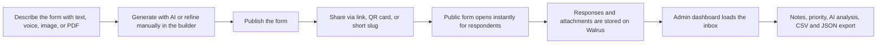
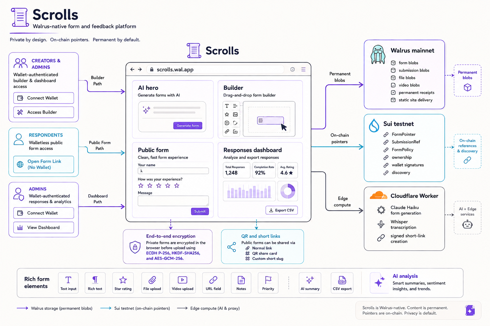
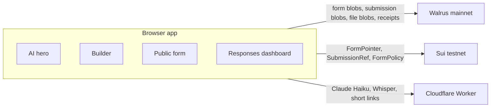
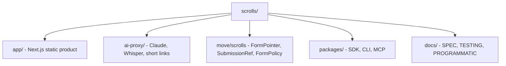

# Scrolls

> Walrus-native form & feedback platform. Build a form, share a link, every response is stored permanently on Walrus.

[](https://www.walrus.xyz/)
[](https://sui.io/)
[](https://developer.mozilla.org/en-US/docs/Web/API/Web_Crypto_API)
[](https://nextjs.org/)

Submission for **Walrus Sessions Round 2 — Form Tooling** ($1,500).

- 🌐 **Live (Walrus Site):** [`scrolls.wal.app`](https://scrolls.wal.app)
- 🌐 **Live (Web):** [`scrolls.fun`](https://scrolls.fun)
- 🎥 **Demo (on Walrus):** *fill in after recording*
- 🐳 **Move package (Sui testnet):** [`0x6418bc0c…7b10a0`](https://suiscan.xyz/testnet/object/0x6418bc0c11e75ef443f7e8fedb9a860b6cc3bfe5909481dc309472ad8b7b10a0)


---

## What it does

| | |
|---|---|
| **Build** | AI-first or manual drag-and-drop builder. Short text, rich text, dropdown, checkbox, star rating, file upload, video upload, URL, and confirmation fields. |
| **Share** | Permanent public URL, QR share card, PNG export, and custom short slugs signed by the creator wallet. |
| **Collect** | Walletless responses for normal respondents, optional wallet signatures for verified submissions, and Walrus-backed storage for every answer and attachment. |
| **Encrypt** | Private forms encrypt responses in the browser before upload using ECDH P-256 + HKDF-SHA256 + AES-GCM-256. |
| **Review** | Admin inbox with notes, priority, AI summaries, topic clustering, sentiment, and CSV or JSON export. |

Respondents do **not** need a wallet by default. Wallet connection is only required when the form owner explicitly disables anonymous submissions or when a respondent wants to attach a wallet signature to their response.

---

## Product flow



---

## Architecture



**No backend, ever.** The frontend is a static export — every byte is shipped to the browser, every data op goes directly to Walrus, Sui, or the Cloudflare Worker (which only proxies AI keys).



| Component | Network | Where |
|---|---|---|
| Form / answer blobs | Walrus mainnet | [`aggregator.walrus.space`](https://aggregator.walrus.space) |
| `FormPointer`, `SubmissionRef`, `FormPolicy` | Sui testnet | `0x6418bc0c…7b10a0` |
| AI proxy + short links | Cloudflare Worker | [`ai-proxy/`](./ai-proxy/) |

---

## Programmatic access

The web builder is one of three ways to use Scrolls. The other two are for scripts and agents:

```bash
# CLI — publish a form from your terminal
npm i -g @scrolls/cli
scrolls init
scrolls create bug-report.yaml

# MCP — let Claude or Cursor drive Scrolls
npm i -g @scrolls/mcp
# then add `scrolls-mcp` to your MCP client's config
```

Same forms, same dashboard, same encryption keys — whichever surface you use, the data lives on Walrus and shows up at [`scrolls.fun/dashboard`](https://scrolls.fun/dashboard).

Full reference: **[docs/PROGRAMMATIC.md](./docs/PROGRAMMATIC.md)** · packages live in [`packages/`](./packages/) ([`sdk`](./packages/sdk/) · [`cli`](./packages/cli/) · [`mcp`](./packages/mcp/)).

---

## Repo layout



For deeper dives:

- [`docs/SPEC.md`](docs/SPEC.md) — product spec
- [`docs/TESTING.md`](docs/TESTING.md) — manual test plan
- [`docs/PROGRAMMATIC.md`](docs/PROGRAMMATIC.md) — SDK, CLI, and MCP guide
- [`DEPLOY.md`](DEPLOY.md) — deploy your own copy

---

## Run locally

```bash
# Terminal 1 — AI proxy (needed for AI features + short links)
cd ai-proxy
pnpm install
cp .dev.vars.example .dev.vars   # add ANTHROPIC_API_KEY (and OPENAI_API_KEY for voice)
pnpm dev                          # http://localhost:8787

# Terminal 2 — app
cd app
pnpm install
cp .env.example .env.local
pnpm dev                          # http://localhost:3000
```

You'll need a Sui extension wallet with a few testnet SUI to publish a form (free from the [faucet](https://faucet.sui.io/)). Walrus blobs in dev go to testnet; flip to mainnet by copying `.env.production.example`.

---

## Deploy

See **[DEPLOY.md](./DEPLOY.md)** — a single 10-minute walkthrough that covers:

1. Cloudflare Worker (`ai-proxy/`) — KV + secrets + `wrangler deploy`
2. Frontend on Vercel (1-click) and/or Walrus Sites (`site-builder deploy`)
3. Optional SuiNS name for a `wal.app` URL

---

## Tech

Next.js 16 · TypeScript · Tailwind · Framer Motion · `@mysten/dapp-kit-react` 2.x · `@mysten/walrus` 1.x · `@mysten/sui` 2.x · Tiptap · dnd-kit · Recharts · qrcode.react · Cloudflare Workers · Anthropic Claude Haiku 4.5 · OpenAI Whisper.

---

## License

MIT — see [LICENSE](./LICENSE).
